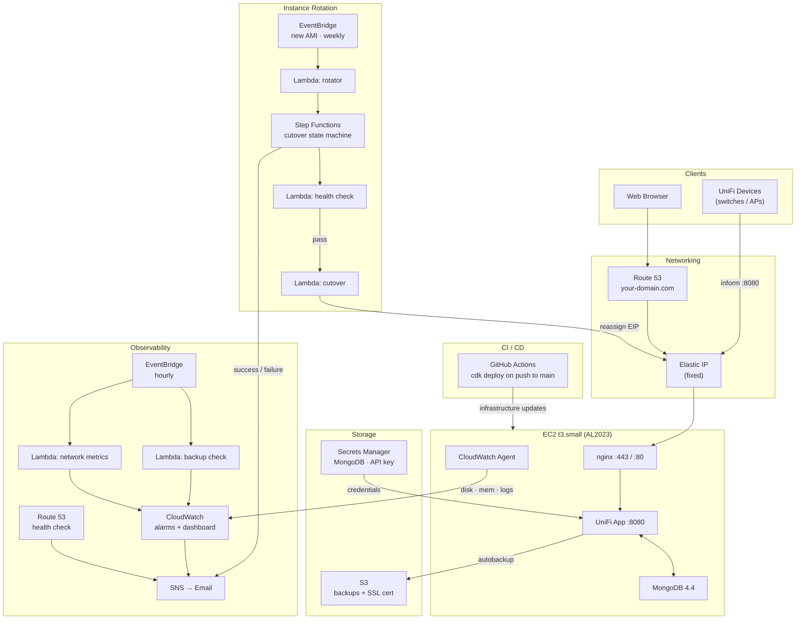

# unifi-cdk

A CDK TypeScript project that runs a self-hosted [UniFi Network Application](https://hub.docker.com/r/linuxserver/unifi-network-application) on AWS EC2 with fully automated instance rotation, backup/restore, SSL certificate management, and observability.

## Architecture



## What it does

### The basic setup

The UniFi controller runs in Docker on a single EC2 instance (t3.small) behind an nginx reverse proxy. A Let's Encrypt SSL certificate is issued via DNS-01 challenge against Route 53, making the controller reachable at a custom domain over HTTPS. A fixed Elastic IP address means the domain never needs updating when the instance is replaced.

### Automated instance rotation

Rather than patching the running instance, the system replaces it entirely whenever a new Amazon Linux 2023 AMI is published. Two things can trigger a rotation:

1. **New AMI** — EventBridge detects when AWS publishes an updated AL2023 AMI and immediately kicks off a replacement
2. **30-day ceiling** — a weekly Lambda check rotates the instance if it hasn't been replaced in the past 30 days, regardless of AMI updates

The rotation flow, orchestrated by AWS Step Functions:

1. A new EC2 instance boots alongside the existing one — your network keeps running on the old one
2. The new instance restores the SSL certificate from S3 (avoiding Let's Encrypt rate limits), downloads the latest UniFi backup, and restores it via the two-step UniFi API
3. After restore, all devices across all sites are force-provisioned via the UniFi API so they come back online immediately
4. Step Functions polls until the new instance passes health checks: EC2 status 2/2, UniFi ports open, and the controller showing the login page (not the setup wizard)
5. The Elastic IP is atomically moved to the new instance — your devices see no IP change
6. The old instance is terminated

If health checks never pass, the new instance is terminated and the old one keeps running. You get an email either way.

### Backup pipeline

- UniFi's built-in autobackup runs on a schedule and saves `.unf` files to `/opt/unifi/config/data/backup/autobackup/`
- An hourly cron syncs those files to S3 (`unifi-backups-<account-id>/backups/`)
- On each new instance, the latest backup is restored automatically
- The SSL certificate is cached in S3 (`unifi-backups-<account-id>/letsencrypt/`) and restored on boot to avoid Let's Encrypt's 5 certs/week rate limit

## Infrastructure

| Resource | Details |
|---|---|
| EC2 | t3.small, AL2023, gp3 30GB + 2GB swap |
| Docker | UniFi Network Application, MongoDB 4.4, Watchtower, nginx |
| Elastic IP | Fixed public IP, re-associated on each rotation |
| S3 | Backups + cached SSL cert, 30-day lifecycle expiry |
| Step Functions | Orchestrates boot wait → health checks → cutover |
| Lambda | 7 functions: health check, cutover, cleanup, rotation trigger, scheduled rotation check, backup freshness check, network metrics |
| EventBridge | New AMI trigger, weekly rotation check, hourly backup check, hourly network metrics |
| SNS | Email alerts for cutover success/failure and all CloudWatch alarms |
| CloudWatch | Disk, memory, backup freshness, network metrics; dashboard; anomaly detection |
| Route 53 | A record + HTTPS health check polling from multiple AWS locations |
| Secrets Manager | MongoDB password (auto-generated), UniFi API key |

## Observability

Alerts (via SNS email) fire when:
- Instance rotation succeeds or fails
- Disk usage exceeds 80%
- Memory usage exceeds 85%
- Your domain fails Route 53 health checks for 3 consecutive minutes
- No backup in S3 newer than 25 hours
- Estimated monthly AWS cost exceeds $25
- AWS Cost Anomaly Detection flags an unusual spend spike

The CloudWatch dashboard (`unifi-controller`) shows disk usage, memory usage, Route 53 health check status, backup freshness, and per-site connected client counts and WAN throughput across all three sites.

## Deploying

```bash
# Normal deploy — updates infrastructure without rotating the instance
npx cdk deploy

# Force a new instance rotation (new AMI, user-data change, etc.)
npx cdk deploy --context forceRotation=true
```

Context values (account-specific, not committed) live in `cdk.context.json`:

```json
{
  "eipAllocationId": "eipalloc-...",
  "hostedZoneId": "Z...",
  "existingInstanceId": "i-...",
  "instanceType": "t3.small",
  "region": "us-east-1",
  "domain": "yourdomain.com",
  "adminEmail": "you@example.com",
  "vpcId": "vpc-...",
  "eipPublicIp": "x.x.x.x"
}
```

## CI

GitHub Actions runs `tsc --noEmit` and `cdk synth` on every push and pull request. Dependabot opens weekly PRs to keep CDK and AWS SDK packages current.
